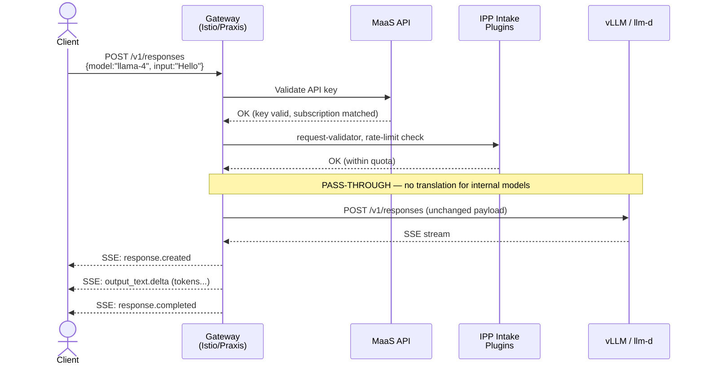
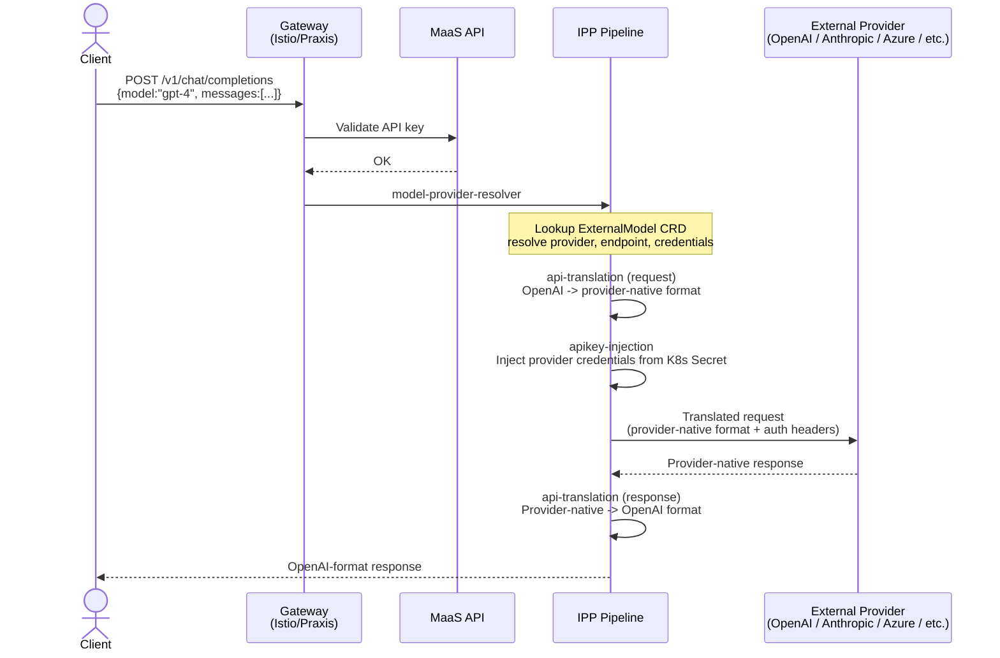
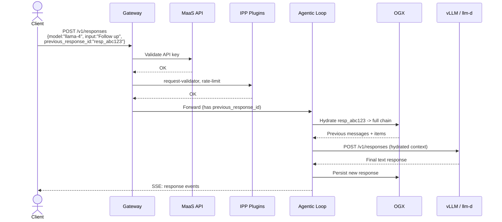
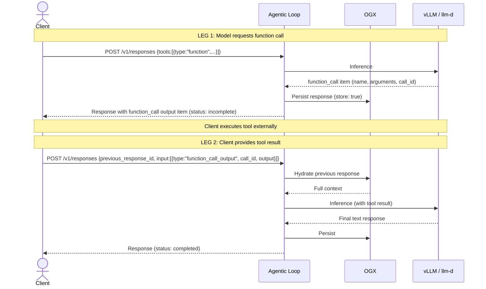
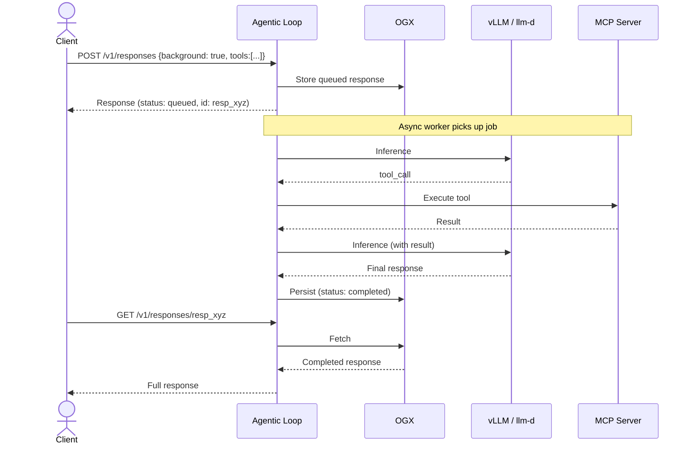

# Responses API — Request Flow Strategy

**Date:** May 15, 2026

---

## Two Worlds: Internal vs External Models

Responses API support requires **two completely different architectures** depending on whether the model is internal (self-hosted) or external (SaaS).

- **Internal models:** Zero API translation. Full fidelity pass-through to vLLM/llm-d.
- **External models:** API translation required. Responses -> Chat Completions -> provider-native format.

---

## Flow 1: Stateless Responses API (Internal Model, Simple Completion)

## Flow 2: Stateful Agentic Loop (Internal Model, MCP Tools)

```mermaid
sequenceDiagram
    actor Client
    participant GW as Gateway<br/>(Istio/Praxis)
    participant MaaS as MaaS API
    participant IPP as IPP Intake<br/>Plugins
    participant AL as Agentic Loop<br/>(vLLM Agentic API)
    participant OGX as OGX<br/>(State Services)
    participant MCP as MCP Server
    participant Guards as Guardrails<br/>Service
    participant vLLM as vLLM / llm-d

    Client->>GW: POST /v1/responses<br/>{model:"llama-4", input:"Search for...",<br/>tools:[{type:"mcp"}],<br/>previous_response_id:"resp_abc123"}

    GW->>MaaS: Validate API key
    MaaS-->>GW: OK

    GW->>IPP: request-validator, rate-limit, model-resolver
    IPP-->>GW: OK (internal model detected)

    GW->>AL: Forward to Agentic Loop

    AL->>OGX: Hydrate previous_response_id
    OGX-->>AL: Conversation context + previous items

    AL->>MCP: tools/list (discover available tools)
    MCP-->>AL: Tool catalog

    AL->>Guards: Input guardrails check
    Guards-->>AL: OK

    rect rgb(30, 50, 30)
        Note over AL,vLLM: LOOP ITERATION 1
        AL->>vLLM: POST /v1/responses (hydrated, no translation)
        vLLM-->>AL: Response with tool_call item
        AL->>Guards: Output guardrails check
        Guards-->>AL: OK
        AL->>MCP: Execute tool call
        MCP-->>AL: Tool result
    end

    rect rgb(30, 50, 30)
        Note over AL,vLLM: LOOP ITERATION 2
        AL->>vLLM: POST /v1/responses (with tool result injected)
        vLLM-->>AL: Final text response (no more tool calls)
    end

    AL->>OGX: Persist response + conversation state
    AL-->>Client: SSE: response.created, output items, response.completed
```

## Flow 3: External Model (SaaS Provider, Chat Completions Translation)

## Flow 4: Stateful Agentic Loop (External Model, MCP Tools)

Each loop iteration requires API translation — adds latency and is inherently lossy.

```mermaid
sequenceDiagram
    actor Client
    participant GW as Gateway<br/>(Istio/Praxis)
    participant MaaS as MaaS API
    participant IPP as IPP Plugins
    participant AL as Agentic Loop<br/>(vLLM Agentic API)
    participant OGX as OGX<br/>(State Services)
    participant MCP as MCP Server
    participant Guards as Guardrails<br/>Service
    participant Provider as External Provider<br/>(OpenAI / Anthropic / etc.)

    Client->>GW: POST /v1/responses<br/>{model:"gpt-4", input:"Search for...",<br/>tools:[{type:"mcp"}],<br/>previous_response_id:"resp_abc123"}

    GW->>MaaS: Validate API key
    MaaS-->>GW: OK

    GW->>IPP: request-validator, rate-limit, model-provider-resolver
    Note over IPP: ExternalModel CRD lookup

    IPP->>AL: Forward to Agentic Loop<br/>(with provider info in CycleState)

    AL->>OGX: Hydrate previous_response_id
    OGX-->>AL: Conversation context

    AL->>MCP: tools/list (discover tools)
    MCP-->>AL: Tool catalog

    AL->>Guards: Input guardrails check
    Guards-->>AL: OK

    rect rgb(50, 30, 30)
        Note over AL,Provider: LOOP ITERATION 1 (with API translation)
        AL->>IPP: api-translation (Responses -> Chat Completions)
        IPP->>IPP: apikey-injection
        IPP->>Provider: Translated request + provider auth
        Provider-->>IPP: Provider-native response
        IPP->>AL: api-translation (response -> OpenAI format)
        AL->>Guards: Output guardrails check
        Guards-->>AL: OK
        Note over AL: tool_call detected
        AL->>MCP: Execute tool call
        MCP-->>AL: Tool result
    end

    rect rgb(50, 30, 30)
        Note over AL,Provider: LOOP ITERATION 2 (with tool result)
        AL->>IPP: api-translation (with tool result injected)
        IPP->>Provider: Translated request
        Provider-->>AL: Final text response (no more tool calls)
    end

    AL->>OGX: Persist response + conversation state
    AL-->>Client: SSE: response.created, output items, response.completed
```

## Flow 5: Multi-Turn Continuation (previous_response_id, no tools)

## Flow 6: Function Tool Round-Trip (Client-Side Tools)

Two legs: first request yields control to client, second resumes after client executes the tool.

## Flow 7: Background Processing

