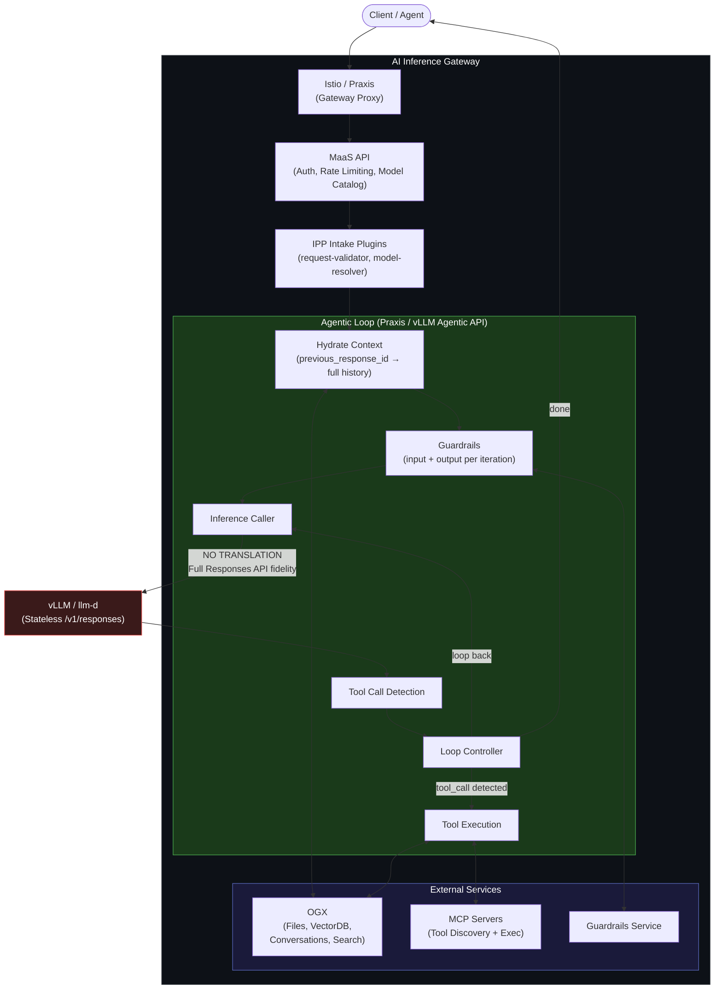
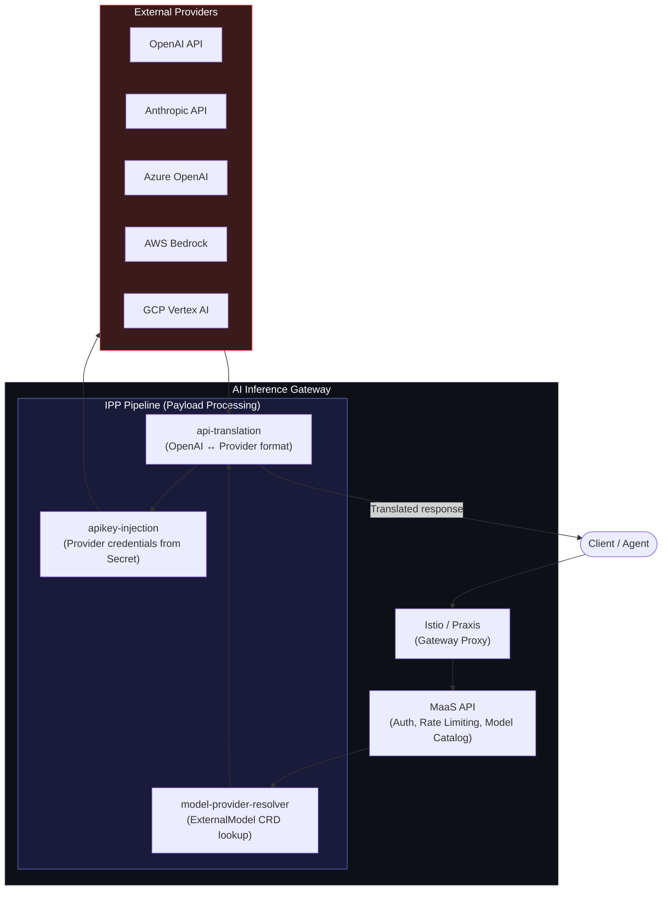
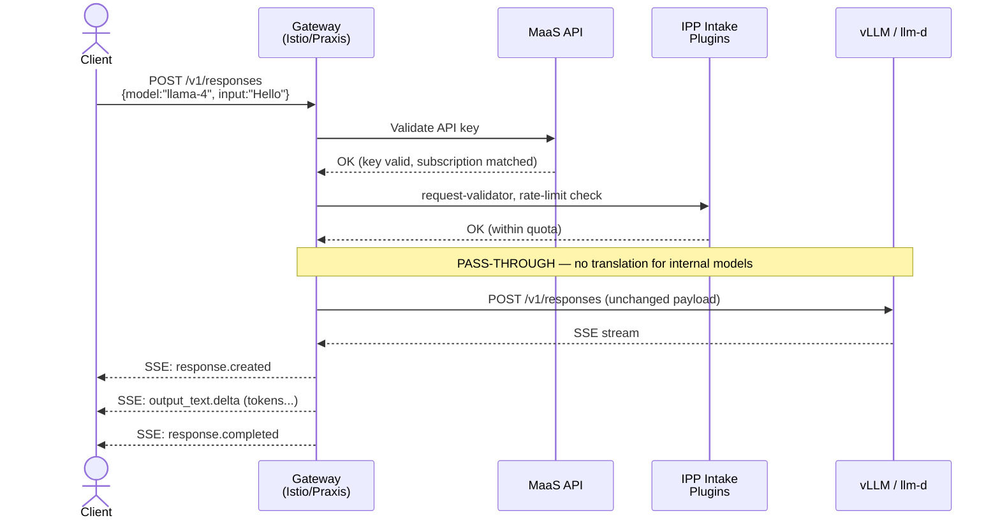
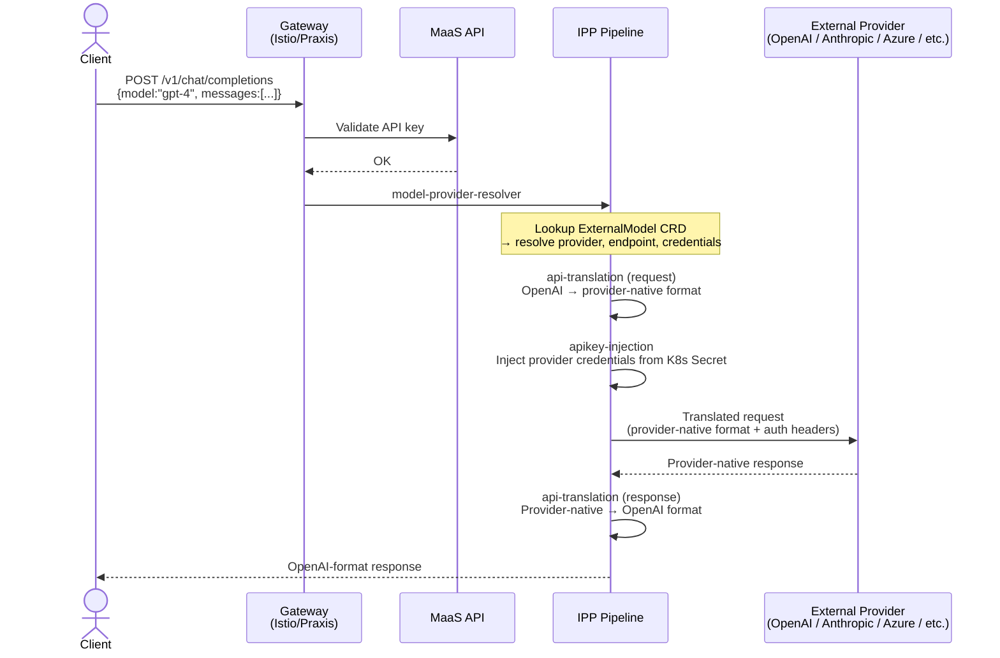

# Responses API Architecture Plan for AI Inference Gateway

**Date:** May 15, 2026
**Author:** Noy Itzikowitz
**Status:** Draft -- post-sync alignment document
**Meeting reference:** Responses API Sync, May 15, 2026

---

## Table of Contents

1. [Executive Summary](#1-executive-summary)
2. [Landscape Analysis](#2-landscape-analysis)
   - [What is the Responses API?](#21-what-is-the-responses-api)
   - [Project Map and Maturity](#22-project-map-and-maturity)
3. [Meeting Decisions and Agreements](#3-meeting-decisions-and-agreements-may-15-2026)
4. [Architecture: Two Worlds](#4-architecture-two-worlds)
   - [Internal Models (vLLM/llm-d)](#41-internal-models-open-weight-on-vllmllm-d)
   - [External Models (SaaS Providers)](#42-external-models-saas-providers)
5. [Component Responsibilities](#5-component-responsibilities)
6. [Request Flow Diagrams](#6-request-flow-diagrams)
7. [Plugin Pipeline Design](#7-plugin-pipeline-design)
8. [Short-Term Plan (0-6 months)](#8-short-term-plan-0-6-months)
9. [Long-Term Plan (6-18 months)](#9-long-term-plan-6-18-months)
10. [Where to Write the Code](#10-where-to-write-the-code)
11. [Open Questions and Risks](#11-open-questions-and-risks)
12. [Appendix: Research Sources](#12-appendix-research-sources)

---

## 1. Executive Summary

The Responses API (`POST /v1/responses`) is OpenAI's successor to Chat Completions. It adds server-side statefulness (`previous_response_id`), built-in tools (web search, file search, code interpreter), MCP server integration, and a server-side agentic loop. The [Open Responses specification](https://www.openresponses.org/) is emerging as the industry standard, backed by OpenAI, Hugging Face, vLLM, Ollama, and others.

Our AI Inference Gateway must support Responses API alongside Chat Completions. The core challenge is that Responses API introduces two fundamentally different traffic patterns:

1. **Stateless pass-through** (single inference call) -- similar to Chat Completions today
2. **Stateful agentic loop** (N inference calls, tool execution, state management) -- fundamentally new

The agreed architecture splits responsibility across components:

| Layer | Component | Responsibility |
|-------|-----------|---------------|
| **Inference** | vLLM core / llm-d | Stateless Responses API (pure inference, no state) |
| **Orchestration** | Praxis + vLLM Agentic API | Stateful agentic loop, tool execution, guardrails |
| **State Services** | OGX | Files, Vector Stores, Conversations, Search |
| **Gateway** | IPP (today) / Praxis (future) | Auth, rate limiting, model routing, API translation (external only) |
| **Platform** | MaaS | API keys, subscriptions, model catalog, multi-tenancy |

**The cardinal rule:** For internal models on vLLM/llm-d, there must be **zero API translation** in the inference path. Full fidelity between client and inference server. The gateway layers on stateful features without changing the inference shape.

---

## 2. Landscape Analysis

### 2.1 What is the Responses API?

The Responses API is a superset of Chat Completions that adds:

| Feature | Chat Completions | Responses API |
|---------|-----------------|---------------|
| **State** | Stateless (client sends full history) | Stateful (`previous_response_id`, server stores context) |
| **Tools** | Client-managed function calling only | Built-in server-side tools + MCP + custom functions |
| **Agent loop** | Client orchestrates tool-call cycle | Server-side agentic loop (built-in tools auto-execute) |
| **Reasoning** | Dropped between calls | Preserved via stored/encrypted reasoning items |
| **Input** | Array of messages with roles | String or messages; separate `instructions` field |
| **Output** | Single message | Array of typed Items (message, reasoning, tool_call, etc.) |
| **Streaming** | Token deltas | 23+ semantic event types with lifecycle tracking |

**Key use cases:** Agentic workflows, server-side RAG, code execution agents, MCP-connected applications, long-running background tasks, multi-turn reasoning with state preservation.

**Industry adoption:** OpenAI native. Open Responses spec partners: Hugging Face, Vercel, OpenRouter, LM Studio, Ollama, vLLM. Notably absent: Anthropic, Google (own agent SDKs).

### 2.2 Project Map and Maturity

#### Core Infrastructure (Our Stack)

| Project | Repo | Language | Maturity | Stars | What It Does |
|---------|------|----------|----------|-------|-------------|
| **IPP (new upstream)** | `llm-d/llm-d-inference-payload-processor` | Go | Early (created Apr 2026, no releases) | 7 | Envoy ext_proc for payload processing. Plugin framework with CycleState. |
| **IPP (old upstream)** | `kubernetes-sigs/gateway-api-inference-extension` | Go | GA (v1.5.0) | 668 | Original home of BBR/EPP. BBR code migrated to new repo. |
| **IPP plugins (downstream)** | `opendatahub-io/ai-gateway-payload-processing` | Go | Active (273 PRs, 97/97 E2E tests) | 5 | 5 production plugins: model-provider-resolver, api-translation, apikey-injection, nemo-guards. Still on old upstream dependency. |
| **MaaS** | `opendatahub-io/models-as-a-service` | Go | Pre-GA (v0.1.1) | 24 | K8s platform for model access: auth, rate limiting, API keys, model catalog. CRDs: Tenant, MaaSModelRef, ExternalModel, MaaSAuthPolicy, MaaSSubscription. |
| **Praxis** | `praxis-proxy/praxis` | Rust | Early (v0.3.1, 6 weeks old) | 23 | AI-native proxy with inline body inspection (StreamBuffer), re-entrant filter chains for agentic loops, MCP classifier. Single-binary replacement for Envoy + ext_proc. |

#### Ecosystem (Community Projects)

| Project | Repo | Language | Maturity | Stars | What It Does |
|---------|------|----------|----------|-------|-------------|
| **vLLM core** | `vllm-project/vllm` | Python/C++ | Production | 50K+ | Leading inference engine. Stateless Responses API merged (Jul 2025). Tool calling WIP. |
| **vLLM Agentic API** | `vllm-project/agentic-api` | Rust (migrating from Python) | Pre-MVP (2 months old) | 26 | Stateful gateway for vLLM: response store, agentic loop, tool execution. Actively debating Rust vs Python. PR #27 proposes Praxis-based architecture. |
| **OGX** (formerly LlamaStack) | `ogx-ai/ogx` | Python | Production (2 years) | 8.4K | Full agentic API server. Files, Vector Stores, Conversations, Safety, Eval. 23 inference providers. Open Responses conformant. |
| **Open Responses** | `openresponses/openresponses` | Spec | Early | - | The emerging standard for Responses API. Defines items, events, tool taxonomy, agentic loop phases. |

#### Maturity Assessment

```
Production-Ready    ██████████████████████████████  vLLM core (inference)
                    ██████████████████████████████  OGX (agentic server)

Active/Functional   ████████████████████░░░░░░░░░░  IPP plugins (downstream)
                    ████████████████░░░░░░░░░░░░░░  MaaS
                    ██████████████░░░░░░░░░░░░░░░░  IPP (new upstream)

Early/Rapid Dev     ████████░░░░░░░░░░░░░░░░░░░░░░  Praxis
                    ██████░░░░░░░░░░░░░░░░░░░░░░░░  vLLM Agentic API

Spec/Design         ████░░░░░░░░░░░░░░░░░░░░░░░░░░  Open Responses
                    ████░░░░░░░░░░░░░░░░░░░░░░░░░░  Dzonca's RFC/Plugin Catalog
```

---

## 3. Meeting Decisions and Agreements (May 15, 2026)

These were explicitly agreed upon during the sync:

### Architecture Split

1. **vLLM core** will implement a **stateless** Responses API (pure inference shape, no state management, no tool execution)
2. **vLLM Agentic API** will implement the **stateful** Responses API (agentic loop, tool calling, state)
3. **OGX** should handle state management: Files, Vector Stores, Search, Conversations
4. **Praxis** is a more AI-native proxy with better abstractions than Envoy ext_proc (payload processing, plugin execution, re-entrant loops)

### Two Distinct Pathways

5. **Internal models (open-weight on vLLM/llm-d):** NO API translation. Full fidelity pass-through. Gateway adds stateful features as a layer on top without changing the inference shape.
6. **External models (SaaS providers):** API translation remains necessary. Different chain of plugins for auth, key injection, format conversion.

### Guardrails

7. Guardrails are **not** transparent inference proxies. They are separate endpoints that receive the payload explicitly. They must understand the Responses API format natively (not via translation to Chat Completions).
8. Input guardrails work on user messages (similar to today). Output guardrails on model responses are harder -- if the guardrail doesn't understand Responses format natively, it creates issues.

### Where to Write Code

9. **Depend on Praxis** in agentic APIs (use Praxis as core layer)
10. **Depend on OGX** in agentic APIs for DB/state services (or make it pluggable)
11. Code goes into **agentic-apis/fork** and other logic areas where rational
12. Wait a few days before kicking off so others can weigh in

### Open Items

13. **ITS (Intelligent Ticket System)** -- raised during sync, needs team alignment
14. A roadmap for the gateway piece is needed
15. A Dev channel for gateway coordination will be created
16. Follow-up needed with customers on Responses API interest

---

## 4. Architecture: Two Worlds

The fundamental insight from the meeting is that Responses API support requires **two completely different architectures** depending on whether the model is internal (self-hosted) or external (SaaS).

### 4.1 Internal Models (Open-Weight on vLLM/llm-d)



**Key principle:** The request hits vLLM in **exactly the same format** the client sent it. The gateway does NOT translate Responses → Chat Completions → back. It hydrates context (conversation retrieval, previous_response_id resolution), applies guardrails, executes tools, and loops -- but the inference call itself is the full Responses API payload with no format changes.

### 4.2 External Models (SaaS Providers)



**Key principle:** External models do NOT support the Responses API natively (only OpenAI does, and even there you'd use their API directly). For external models, the gateway does the traditional Chat Completions flow with API translation. If a client sends Responses API format, the gateway must translate to Chat Completions for the external provider, then translate the response back. This is lossy but necessary for SaaS models we don't control.

---

## 5. Component Responsibilities

### vLLM Core (Stateless Inference)

| Responsibility | Details |
|---------------|---------|
| Stateless Responses API | Accept `/v1/responses` requests, produce responses with Items. No state management. |
| Chat Completions | Existing `/v1/chat/completions` continues unchanged. |
| Messages API | Existing `/v1/messages` continues unchanged. |
| Token generation | Core competency: fast, efficient inference with KV-cache, speculative decoding, etc. |
| **NOT responsible for** | State storage, agentic loops, tool execution, conversation history, file/vector stores. |

### vLLM Agentic API / Praxis (Stateful Orchestration)

| Responsibility | Details |
|---------------|---------|
| Agentic loop | Orchestrate multi-turn tool-calling loops within a single request lifecycle. |
| State management | Response store (previous_response_id), conversation context. |
| Tool execution | Server-side tools (web search, file search, code interpreter) and MCP tool discovery/execution. |
| Guardrails (within loop) | Input/output content safety checks per loop iteration. |
| Context hydration | Resolve `previous_response_id`, load conversation history, inject into inference request. |
| SSE streaming | Produce semantic Responses API events (23+ types) from inference stream. |
| **NOT responsible for** | Token generation, model weights, KV-cache management. |

### OGX (State Services)

| Responsibility | Details |
|---------------|---------|
| Files API | `POST /v1/files`, file upload, chunking, storage. |
| Vector Stores | `POST /v1/vector_stores`, embedding, indexing, semantic search. |
| Conversations | Durable conversation objects, item storage, cross-session persistence. |
| Search | Retrieval over vector stores (file_search tool backend). |
| Batches | Offline batch processing for large workloads. |
| **NOT responsible for** | Inference, agentic loop orchestration, model routing. |

### IPP / Payload Processor (Gateway Plugins)

| Responsibility | Details |
|---------------|---------|
| Auth (external models) | Validate API keys, inject provider credentials. |
| Rate limiting | Token-based quota enforcement per subscription. |
| Model routing | Resolve model name → provider + endpoint via ExternalModel CRD. |
| API translation | Convert between OpenAI ↔ provider-native formats (external models ONLY). |
| Guardrails (intake) | Pre-inference content safety (NeMo guardrails). |
| **NOT responsible for** | Agentic loops, state management, tool execution. For internal models, NOT responsible for any API translation. |

### MaaS (Platform Layer)

| Responsibility | Details |
|---------------|---------|
| API key management | Minting, validation, hash storage of `sk-oai-*` keys. |
| Subscriptions & quotas | Token-based rate limits per user/group/model. |
| Model catalog | Unified `/v1/models` across internal and external models. |
| Auth policies | Who can access which models (MaaSAuthPolicy CRD). |
| Tenant management | Platform-level configuration. |
| **NOT responsible for** | Request payload processing, agentic loops, inference. |

### Praxis (Future Proxy Layer)

| Responsibility | Details |
|---------------|---------|
| Proxy & routing | Replace Envoy/Istio data plane for AI traffic. |
| Inline body inspection | StreamBuffer for model name extraction, protocol detection (no ext_proc roundtrip). |
| Re-entrant loops | Branch chains for agentic loop orchestration within the proxy. |
| Plugin execution | Run Rust filters for auth, rate limiting, guardrails, translation. |
| MCP gateway | Tool catalog, session management, backend registry. |
| **NOT responsible for** | Being a standalone agentic server. Praxis is the runtime; plugins/filters provide the logic. |

---

## 6. Request Flow Diagrams

### Flow 1: Stateless Responses API (Internal Model, Simple Completion)



### Flow 2: Stateful Agentic Loop (Internal Model, MCP Tools)

```mermaid
sequenceDiagram
    actor Client
    participant GW as Gateway<br/>(Istio/Praxis)
    participant MaaS as MaaS API
    participant IPP as IPP Intake<br/>Plugins
    participant AL as Agentic Loop<br/>(Praxis / Agentic API)
    participant OGX as OGX<br/>(State Services)
    participant MCP as MCP Server
    participant Guards as Guardrails<br/>Service
    participant vLLM as vLLM / llm-d

    Client->>GW: POST /v1/responses<br/>{model:"llama-4", input:"Search for...",<br/>tools:[{type:"mcp"}],<br/>previous_response_id:"resp_abc123"}

    GW->>MaaS: Validate API key
    MaaS-->>GW: OK

    GW->>IPP: request-validator, rate-limit, model-resolver
    IPP-->>GW: OK (internal model detected)

    GW->>AL: Forward to Agentic Loop

    AL->>OGX: Hydrate previous_response_id → full conversation history
    OGX-->>AL: Conversation context + previous items

    AL->>MCP: tools/list (discover available tools)
    MCP-->>AL: Tool catalog

    AL->>Guards: Input guardrails check
    Guards-->>AL: OK

    rect rgb(30, 50, 30)
        Note over AL,vLLM: LOOP ITERATION 1
        AL->>vLLM: POST /v1/responses (hydrated, no translation)
        vLLM-->>AL: Response with tool_call item
        AL->>Guards: Output guardrails check
        Guards-->>AL: OK
        AL->>MCP: Execute tool call
        MCP-->>AL: Tool result
    end

    rect rgb(30, 50, 30)
        Note over AL,vLLM: LOOP ITERATION 2
        AL->>vLLM: POST /v1/responses (with tool result injected)
        vLLM-->>AL: Final text response (no more tool calls)
    end

    AL->>OGX: Persist response + conversation state
    AL-->>Client: SSE: response.created, output items, response.completed
```



### Flow 3: External Model (SaaS Provider, Chat Completions Translation)



---

## 7. Plugin Pipeline Design

Based on the unified plugin catalog RFC, the target architecture defines a **20-plugin pipeline** that handles both Chat Completions and Responses API through the same chain with conditional execution.

### Unified Pipeline (Target State)

```
                    ┌─── INTAKE (runs once) ───────────────────────┐
                    │                                              │
                    │  1. auth                    [Exists in IPP]  │
                    │  2. rate-limit (check)      [Exists in IPP]  │
                    │  3. request-validator        [Extends IPP]   │
                    │  4. hydrate-prompt           [NEW]           │
                    │  5. conversation-manager     [NEW]           │
                    │  6. tool-registry            [NEW]           │
                    │  7. guardrails (input)       [Extends IPP]   │
                    │  8. model-provider-resolver  [Exists in IPP] │
                    │                                              │
                    └──────────────────────────────────────────────┘
                                         │
                                         ▼
                    ┌─── INFERENCE LOOP (iterates for Responses) ──┐
                    │                                              │
                    │  9. api-translation (req)   [Extends IPP]   │
                    │ 10. body-field-to-header    [Exists in IPP]  │
                    │ 11. base-model-to-header    [Exists in IPP]  │
                    │ 12. apikey-injection        [Exists in IPP]  │
                    │          ┌──── MODEL CALL ────┐              │
                    │ 13. inference-caller         [NEW]           │
                    │          └────────────────────┘              │
                    │ 14. api-translation (resp)  [Extends IPP]   │
                    │ 15. guardrails (output)     [Extends IPP]   │
                    │ 16. rate-limit (usage)      [Exists in IPP] │
                    │ 17. tool-call-handler        [NEW]           │
                    │ 18. loop-controller          [NEW]           │
                    │ 19. server-tool-executor     [NEW]           │
                    │ 20. mcp-executor             [NEW]           │
                    │                                              │
                    │         ──── LOOP BACK to #9 ────           │
                    └──────────────────────────────────────────────┘
                                         │
                                         ▼
                    ┌─── COMPLETION (Responses only) ──────────────┐
                    │                                              │
                    │ 21. response-assembler       [NEW]           │
                    │ 22. response-store           [NEW]           │
                    │ 23. conversation-manager     [NEW] (save)    │
                    │                                              │
                    └──────────────────────────────────────────────┘
```

### Plugin Classification

| # | Plugin | Boundary | Status | Complexity |
|---|--------|----------|--------|------------|
| 1 | auth | External | Exists (IPP) | S |
| 2 | rate-limit | External | Exists (IPP) | S |
| 3 | request-validator | Local | Extends IPP | M |
| 4 | hydrate-prompt | External | **NEW** | L |
| 5 | conversation-manager | External | **NEW** | M |
| 6 | tool-registry | External | **NEW** | M |
| 7 | guardrails | External | Extends IPP | M |
| 8 | model-provider-resolver | External | Exists (IPP) | S |
| 9 | api-translation | Local | Extends IPP | L |
| 10 | body-field-to-header | Local | Exists (IPP) | S |
| 11 | base-model-to-header | External | Exists (IPP) | S |
| 12 | apikey-injection | External | Exists (IPP) | S |
| 13 | inference-caller | External | **NEW** | M |
| 14 | tool-call-handler | Local | **NEW** | S |
| 15 | loop-controller | Local | **NEW** | S |
| 16 | server-tool-executor | External | **NEW** | L |
| 17 | host-tool-executor | Sandboxed | **NEW** | M |
| 18 | mcp-executor | External | **NEW** | L |
| 19 | response-assembler | Local | **NEW** | M |
| 20 | response-store | External | **NEW** | S |

**Summary:** 7 exist in IPP (reuse/extend), 13 are new for Responses API.

### Conditional Execution

For Chat Completions requests, plugins 4-6, 13-15, 17-20 are **skipped** (no agentic loop, no response store). The pipeline collapses to the existing IPP flow. The `request-validator` plugin detects the API type and sets a CycleState flag that gates downstream execution.

For internal models, plugins 9 (api-translation req), 12 (apikey-injection), and 14 (api-translation resp) are **skipped** or become no-ops (pass-through). No translation for native vLLM/llm-d Responses API.

---

## 8. Short-Term Plan (0-6 months)

### Phase 1: Foundation (Months 1-2)

**Goal:** Stateless Responses API pass-through for internal models. No agentic loop yet.

| Task | Where | Owner |
|------|-------|-------|
| Add `/v1/responses` route to MaaS HTTPRoute generation | `models-as-a-service` (maas-controller) | MaaS team |
| Request-validator plugin: detect Responses vs Chat Completions format | `ai-gateway-payload-processing` | IPP team |
| Stateless pass-through: forward `/v1/responses` to vLLM with zero translation | `ai-gateway-payload-processing` | IPP team |
| Verify vLLM's stateless Responses API works E2E through the gateway | E2E tests | QE |
| SSE streaming pass-through: ensure gateway doesn't break semantic events | `ai-gateway-payload-processing` | IPP team |

**Deliverable:** A client can send `POST /v1/responses` to the AI Gateway, it passes through MaaS auth/RL, and reaches vLLM unchanged. Response streams back with full fidelity.

### Phase 2: External Model Support (Months 2-4)

**Goal:** Responses API support for external models via translation.

| Task | Where | Owner |
|------|-------|-------|
| Extend api-translation plugin to handle Responses API → Chat Completions for external providers | `ai-gateway-payload-processing` | IPP team |
| Response translation: Chat Completions response → Responses API Items format | `ai-gateway-payload-processing` | IPP team |
| Decide: do we support Responses API → OpenAI Responses API (direct, no translation)? | Design decision | Team |
| Extend E2E tests for Responses API on all 5 providers | `ai-gateway-payload-processing` | QE |
| Guardrails: extend NeMo guards to parse Responses API input format | `ai-gateway-payload-processing` | IPP team |

**Deliverable:** External model users can send Responses API format and get correct responses from all providers.

### Phase 3: Agentic Loop POC (Months 4-6)

**Goal:** Proof-of-concept agentic loop for internal models with MCP tool support.

| Task | Where | Owner |
|------|-------|-------|
| Contribute to vLLM Agentic API project (Praxis-based architecture per PR #27) | `vllm-project/agentic-api` | Team + community |
| Implement response-store plugin (SQLite/PostgreSQL) | `vllm-project/agentic-api` or `ai-gateway-payload-processing` | TBD |
| Implement conversation-manager plugin (previous_response_id resolution) | Same | TBD |
| MCP tool discovery and execution (basic) | Same | TBD |
| Loop controller: single-iteration then multi-iteration | Same | TBD |
| Demo: client sends Responses API request with MCP tools, server executes tool loop | Demo | Team |

**Deliverable:** Working POC of agentic loop with MCP tools on internal model.

---

## 9. Long-Term Plan (6-18 months)

### Phase 4: Praxis Migration (Months 6-12)

**Goal:** Replace Envoy + ext_proc with Praxis for AI traffic.

| Task | Where | Owner |
|------|-------|-------|
| Rewrite IPP plugins as Praxis Rust filters | `praxis-proxy/praxis` or downstream | IPP team |
| StreamBuffer body inspection replaces ext_proc gRPC roundtrips | `praxis-proxy/praxis` | Praxis team |
| Re-entrant filter chains for agentic loop orchestration | `praxis-proxy/praxis` | Praxis team |
| Praxis Kubernetes operator integration | `praxis-proxy/operator` | Praxis team |
| Benchmark: Praxis vs Envoy+ext_proc latency comparison | Performance testing | Team |
| Migration path: Praxis as Envoy ext_proc server (intermediate step) | `praxis-proxy/extproc` | Team |

### Phase 5: Full Agentic Platform (Months 9-15)

**Goal:** Production-ready Responses API with full tool support.

| Task | Where | Details |
|------|-------|---------|
| OGX integration for Files/Vector Stores/Conversations | OGX + gateway | Use OGX as state service backend |
| Built-in tools: file_search, web_search, code_interpreter | Agentic loop | Server-side execution |
| Background mode (`background: true`) | Agentic loop | Async worker pool, polling endpoint |
| Function tool round-trip (client-side tools) | Agentic loop | Yield control to client, resume on callback |
| Multi-tenancy for state services | MaaS + OGX | Quota management for Files, Vector Stores |
| Guardrails: native Responses API format (no translation) | Guardrails service | Per-iteration guardrails within loop |

### Phase 6: Unified Gateway (Months 12-18)

**Goal:** Simplified architecture with Praxis as the single proxy + orchestrator.

| Component | Current | Target |
|-----------|---------|--------|
| Proxy | Istio/Envoy | Praxis |
| Body inspection | ext_proc gRPC (Go) | Inline Praxis filters (Rust) |
| Agentic loop | External service | Praxis re-entrant filter chains |
| Plugin system | Go CycleState framework | Rust filter pipeline with branch chains |
| MCP gateway | Not implemented | Praxis built-in (tool catalog, session mgmt) |
| Config | Kuadrant CRDs → AuthPolicy/RateLimitPolicy | Direct Praxis YAML or operator CRDs |

### Target Architecture Diagram (Long-Term)

```mermaid
graph TB
    Client([Client / Agent])

    subgraph GW["AI Inference Gateway"]
        direction TB

        subgraph Praxis["Praxis Proxy (Rust)"]
            direction TB

            subgraph Intake["Intake Filters (run once)"]
                auth["auth"]
                rl["rate-limit"]
                rv["request-validator"]
                cm["conversation-manager"]
                tr["tool-registry"]
                mr["model-resolver"]
            end

            subgraph Loop["Loop Filters (re-entrant for Responses API)"]
                at["api-translation<br/>(external only)"]
                ic["inference-caller"]
                guard["guardrails"]
                tch["tool-call-handler"]
                lc["loop-controller"]
                mcp_exec["mcp-executor"]
                ste["server-tool-executor"]
            end

            subgraph Completion["Completion Filters"]
                ra["response-assembler"]
                rs["response-store"]
            end
        end

        subgraph ExtServices["External Services"]
            OGX["OGX State Services<br/>(Files, VectorDB, Conversations, Search)"]
            MCP["MCP Servers"]
            NeMo["Guardrails Service"]
        end

        MaaSBox["MaaS API<br/>(Auth, API Keys, Model Catalog, Subscriptions)"]
    end

    subgraph Backends["Inference Backends"]
        vLLM_A["vLLM Pod A<br/>(llm-d)"]
        vLLM_B["vLLM Pod B<br/>(llm-d)"]
        ExtProv["External Provider<br/>(OpenAI / Anthropic / Azure / etc.)"]
    end

    Client --> Praxis
    Intake --> Loop
    Loop -- "re-entrant loop" --> Loop
    Loop --> Completion
    Completion --> Client

    cm <--> OGX
    guard <--> NeMo
    mcp_exec <--> MCP
    ste <--> OGX
    rs <--> OGX

    ic --> vLLM_A
    ic --> vLLM_B
    at --> ExtProv

    style Praxis fill:#0d1117,stroke:#58a6ff,color:#fff
    style Intake fill:#1a3a1a,stroke:#4CAF50,color:#fff
    style Loop fill:#3a2a0a,stroke:#FF9800,color:#fff
    style Completion fill:#1a1a3a,stroke:#5C6BC0,color:#fff
    style ExtServices fill:#1a1a2a,stroke:#7C4DFF,color:#fff
    style Backends fill:#3a1a1a,stroke:#EF5350,color:#fff
    style GW fill:#0a0a15,stroke:#30363d,color:#fff
```



---

## 10. Where to Write the Code

Based on meeting decisions and architecture analysis:

| What | Where | Why |
|------|-------|-----|
| **Agentic loop core** (orchestration, state, tools) | `vllm-project/agentic-api` (contribute upstream) | Community project; Praxis-based architecture (PR #27). This is the agreed home for stateful orchestration in the vLLM community. |
| **Agentic loop plugins** (Rust filters) | `vllm-project/agentic-api` or Praxis plugins repo | Plugins compiled into Praxis; don't need to live in same repo. |
| **Gateway intake plugins** (auth, RL, model-resolver, api-translation) | `ai-gateway-payload-processing` (short-term, Go) → Praxis filters (long-term, Rust) | Existing plugins work today. Rewrite to Rust when Praxis is ready. |
| **OGX state service integration** | `vllm-project/agentic-api` depends on OGX APIs | OGX provides Files, Vector Stores, Conversations as microservices. |
| **MaaS route support** | `opendatahub-io/models-as-a-service` | HTTPRoute generation for `/v1/responses`. |
| **Praxis core capabilities** | `praxis-proxy/praxis` (contribute upstream) | Re-entrant loops, MCP gateway, sub-requests -- core proxy features. |
| **Guardrails extensions** | `ai-gateway-payload-processing` (short-term) → Praxis filter (long-term) | Extend NeMo guards for Responses API format. |
| **Documentation & visualizer** | `noyitz/ai-gateway-docs` | Flow diagrams, architecture docs, plugin catalog. |
| **E2E tests** | `noyitz/api-tests` + `ai-gateway-payload-processing` E2E suite | Responses API E2E across internal + external models. |

---

## 11. Open Questions and Risks

### Open Questions

1. **Who owns the agentic loop in our product?** The vLLM Agentic API project is community-driven and pre-MVP. If it doesn't mature fast enough, do we build our own orchestration in Praxis plugins?

2. **Praxis maturity risk.** Praxis is 6 weeks old with a small contributor base. The v0.5.0 milestone (Responses API, 158 issues) is due Jul 27. Can it deliver?

3. **OGX dependency.** OGX (formerly LlamaStack) provides state services but it's a Python server. Performance concerns for high-throughput state operations? Do we need a Rust/Go alternative?

4. **Migration from old upstream to new upstream.** The downstream `ai-gateway-payload-processing` still depends on `kubernetes-sigs/gateway-api-inference-extension`. When does it migrate to `llm-d/llm-d-inference-payload-processor`?

5. **Responses API for external models -- how lossy is translation?** The agreed rule is "no translation" for internal models. For external models, Responses → Chat Completions is inherently lossy (reasoning items, items array, semantic streaming). How much do we invest in making this work well vs telling users to use Chat Completions for external models?

6. **Multi-tenancy for state.** MaaS quota management for Files, Vector Stores, etc. How do entitlements work? Who pays for vector store storage?

7. **ITS (Intelligent Ticket System)** -- raised during sync. What is it and how does it fit?

8. **Customer demand.** Need to follow up on customer interest in Responses API. Until we hear back, we're building speculatively.

### Risks

| Risk | Impact | Mitigation |
|------|--------|------------|
| Praxis doesn't mature fast enough | Stuck on Envoy+ext_proc, can't do re-entrant loops | Keep Go IPP working; Praxis ext_proc bridge as fallback |
| vLLM Agentic API project stalls (Rust vs Python debate) | No community-backed agentic loop | Build in Praxis plugins independently; contribute back later |
| Open Responses spec doesn't get traction | No standard to build against | Build against OpenAI's actual API; spec is a bonus |
| OGX/LlamaStack strategic shift by Meta | State services dependency at risk | Abstract state service interface; allow pluggable backends |
| Guardrails can't handle Responses API natively | Output guardrails break on Items format | Invest in guardrail Responses API support early |
| External model translation is too lossy | Poor UX for SaaS model users | Be transparent about limitations; recommend Chat Completions for external models where fidelity matters |

---

## 12. Appendix: Research Sources

### Repos Analyzed

| Repo | URL |
|------|-----|
| IPP (old upstream) | https://github.com/kubernetes-sigs/gateway-api-inference-extension |
| IPP (new upstream) | https://github.com/llm-d/llm-d-inference-payload-processor |
| IPP plugins (downstream) | https://github.com/opendatahub-io/ai-gateway-payload-processing |
| MaaS | https://github.com/opendatahub-io/models-as-a-service |
| Praxis | https://github.com/praxis-proxy/praxis |
| vLLM Agentic API | https://github.com/vllm-project/agentic-api |
| OGX (formerly LlamaStack) | https://github.com/ogx-ai/ogx |
| Open Responses | https://www.openresponses.org/ |

### Design Documents

| Document | URL |
|----------|-----|
| RFC: AI Plugin Concept | https://github.com/danielezonca/ai-gateway-docs/blob/responses-api-wip/responses-api/rfc-ai-plugin-concept.md |
| Agentic Loop Phases | https://github.com/danielezonca/ai-gateway-docs/blob/responses-api-wip/responses-api/responses-api-agentic-loop.md |
| Unified Plugin Catalog | https://github.com/danielezonca/ai-gateway-docs/blob/responses-api-wip/responses-api/agentic-loop-plugins.md |
| Responses API Flow Visualizer | https://noyitz.github.io/ai-gateway-docs/responses-api/ |
| AI Gateway Flow Visualizer | https://noyitz.github.io/ai-gateway-docs/ai-gateway-flow.html |

### Meeting References

| Meeting | Date |
|---------|------|
| Responses API Sync | May 15, 2026 |
| AI Gateway F2F (Boston) | ~May 1, 2026 |

### Key API References

| API | Documentation |
|-----|--------------|
| OpenAI Responses API | https://developers.openai.com/api/reference/responses/overview |
| Open Responses Spec | https://www.openresponses.org/specification |
| OpenAI Responses vs Chat Completions | https://platform.openai.com/docs/guides/responses-vs-chat-completions |
| vLLM OpenAI-Compatible Server | https://docs.vllm.ai/en/stable/serving/openai_compatible_server/ |

---

*This document was generated on May 15, 2026 based on research across 8 repositories, 2 meeting transcripts, 6 design documents, and the OpenAI/Open Responses specifications.*
